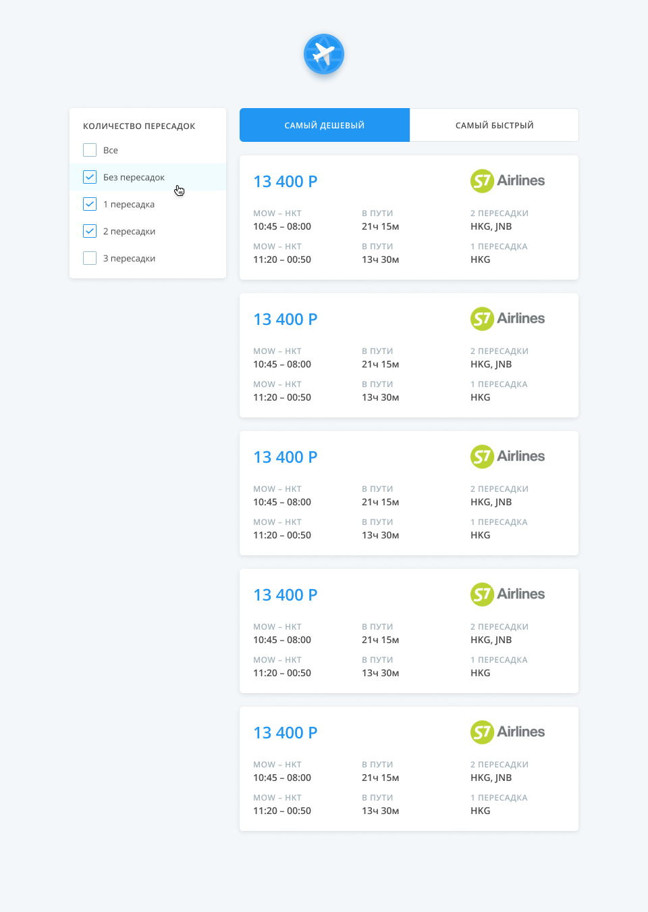

# Тестовое задание Aviasales ([frontend](https://aviasales.recruitee.com/o/frontend-developer-js-coffeescript-react%C2%A0redux--aviasalesru))

Основной frontend проект нашей команды — это страница выдачи билетов со множеством фильтров,
настроек и, собственно, билетов. Проект написан на React, поэтому тестовое задание приближено к
ежедневным задачам.

Перед тобой упрощенный макет нашего проекта — список билетов, фильтры и сортировка. Также у нас есть
небольшой сервер для тестового задания, который работает схоже с нашим основным backend движком и
реализует технику long polling для передачи пачек билетов. Тебе необходимо реализовать клиент,
который будет получать случайно сгенерированные билеты от сервера и отрисует интерфейс согласно
макету в Figma.

## Документация по работе с сервером: [Здесь](https://github.com/KosyanMedia/test-tasks/blob/master/aviasales_frontend/server.md)

## Макет

https://www.figma.com/file/4fQe1lEbo4DARjvNtaU0uJ/Aviasales-test-task

Картинки авиакомпаний берутся с CDN: `//pics.avs.io/99/36/{IATA_CODE_HERE}.png`

## Client side

- Folder `client`
- Initial install `npm i`
- `npm start`
